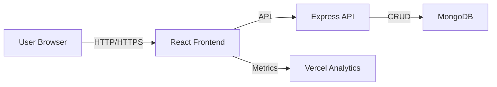
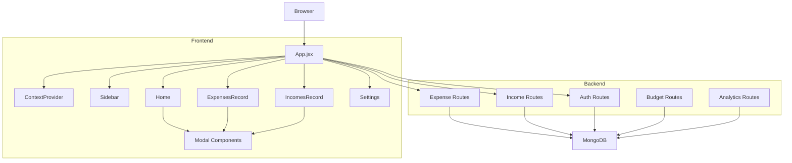
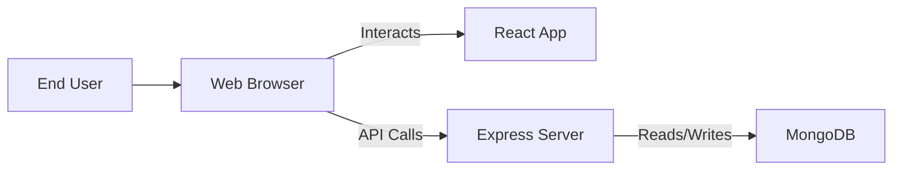
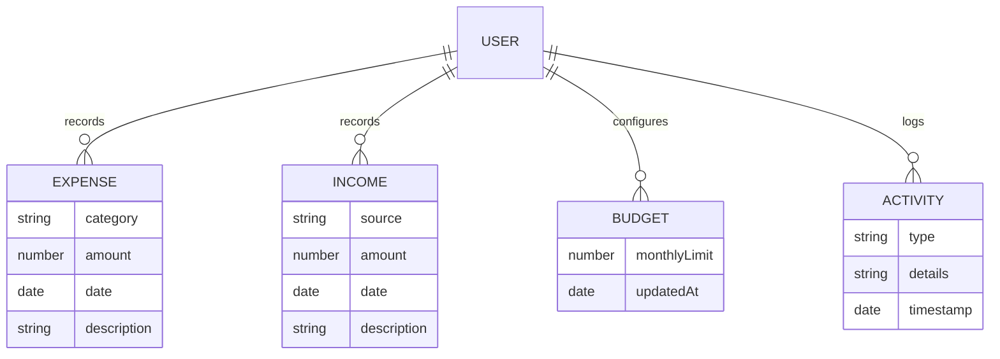

# TrackNest Project Report

## II. Main Report

### Chapter 1: Introduction

#### 1.1. Introduction

TrackNest is a responsive web-based expense tracker that helps users manage incomes, expenses, budgets, and analytics in one secure application. It combines a React frontend with an Express backend and MongoDB for persistence.

#### 1.2. Problem Statement

Users frequently struggle to manage personal finances without an integrated and easy-to-use interface. Existing tools often lack intelligent categorization, budget warnings, and seamless analytics. TrackNest solves this by presenting intuitive dashboards, secure authentication, and transaction management.

#### 1.3. Objectives

- Build a full-stack personal finance tracker.
- Enable expense and income recording with category support.
- Add budget monitoring and alert notifications.
- Provide analytical visualizations for spending.
- Secure user sessions via token-based authentication.
- Include testing for frontend, backend, and system behavior.

#### 1.4. Scope and Limitation

**Scope:**
- User registration, login, and profile verification.
- Expense and income transaction management.
- Dashboard and record pages.
- Budget settings and monitoring.
- Activity history and analytics.
- Frontend and backend testing.

**Limitations:**
- No role-based user management beyond standard accounts.
- AI assistant is currently UI-level and does not connect to a live AI engine.
- Deployment automation is not included.

#### 1.5. Development Methodology

The project is built with a modular agile approach. Frontend and backend development proceed in parallel, with an emphasis on reusable components, REST API design, and automated testing.

#### 1.6. Report Organization

This report covers:
- Chapter 1: Introduction
- Chapter 2: Background Study and Literature Review
- Chapter 3: System Analysis
- Chapter 4: System Design
- Chapter 5: Implementation and Testing
- Chapter 6: Conclusion and Future Recommendations

---

### Chapter 2: Background Study and Literature Review

#### 2.1. Background Study

Expense tracking applications collect, categorize, and summarize financial data to help users understand their spending habits. TrackNest is designed to centralize income and expense entries while offering budget visibility.

#### 2.2. Literature Review

Key technologies and design patterns:
- React for responsive UI.
- Express for backend API.
- MongoDB for flexible storage.
- Token-based auth for secure sessions.
- Chart visualizations for analytics.
- Cypress, Vitest, and Jest for testing.

Similar systems usually support:
- Transaction listing and filters.
- Monthly budget warnings.
- Time-based analytics and charts.
- Profile and settings management.

---

### Chapter 3: System Analysis

#### 3.1. Requirement Analysis

i. Functional Requirements:
- User registration and login.
- Secure token-based authentication.
- Expense and income creation.
- Viewing expenses and incomes.
- Budget monitoring and alerts.
- Protected dashboard pages.
- Reset user financial data.

ii. Non-Functional Requirements:
- Responsive and accessible UI.
- Fast dashboard rendering.
- Secure storage of authentication data.
- Maintainable modular architecture.

#### 3.2. Feasibility Analysis

i. Technical: React, Express, and MongoDB are suitable.
ii. Operational: Web access through browser.
iii. Economic: Uses open-source components.
iv. Schedule: Modular design supports incremental delivery.

#### 3.3. Analysis Approach

The system was analyzed by identifying key user flows, defining data entities, and mapping frontend pages to backend endpoints. This ensures the application delivers a complete expense tracking workflow.

---

### Chapter 4: System Design

#### 4.1. Design Approach

The system architecture separates concerns into:
- Presentation layer: React frontend.
- Business logic layer: Express backend.
- Data layer: MongoDB.

This allows each layer to be developed and tested independently.

#### 4.2. Database Design

Primary collections:
- `User` — user profile, email, password hash, preferences.
- `Expense` — user ID, category, amount, date, description.
- `Income` — user ID, source, amount, date, description.
- `Budget` — user ID, monthly budget, current usage.
- `Activity` — user ID, action type, timestamp, details.

#### 4.3. Forms and Interface Design

Main forms:
- Login and registration.
- Expense modal.
- Income modal.
- Budget configuration modal.
- Profile update forms.

Reports and dashboards show:
- Total balance.
- Monthly income and expense totals.
- Budget progress.
- Recent activities.

#### 4.4. Component Design

Key React components:
- `Sidebar`, `NavBar`, `Home`, `ExpensesRecord`, `IncomesRecord`, `Settings`.
- `Modal`, `BudgetModal`, `ResetDataModal`, `EditProfileModal`, `AIBot`.
- `ProtectedRoutes`, `ContextProvider`, `Chart`, `RecentActs`, `TopExpenses`, `TopIncomes`.

Backend modules:
- `authRoutes`, `expensesRoutes`, `incomesRoutes`, `budgetRoutes`, `analyticsRoutes`, `recurringRoutes`, `accountRoutes`.

#### 4.5. Architecture Diagrams

**System Architecture**

**Component Diagram**

**Deployment Diagram**

**ER Diagram**

---

### Chapter 5: Implementation and Testing

#### 5.1. Implementation

**Tools Used:**
- React, Vite, React Router, Framer Motion, React Toastify, Chart.js
- Node.js, Express, dotenv, cors
- MongoDB
- Vitest, Jest, Supertest, Cypress

**Frontend Implementation:**
- `App.jsx` handles routing and layout.
- `ContextProvider.jsx` handles authentication state.
- `Home.jsx` displays dashboard metrics.
- `ExpensesRecord.jsx` and `IncomesRecord.jsx` display transactions.
- `Modal.jsx` handles transaction form entry.
- `BudgetModal.jsx` manages budget settings.
- `AIBot.jsx` simulates intelligent financial assistance.

**Backend Implementation:**
- `server/index.js` initializes the server and connects to MongoDB.
- `authRoutes.js` manages login, register, and verification.
- `expensesRoutes.js` and `incomesRoutes.js` manage transactions.
- `budgetRoutes.js` manages budget data.
- `analyticsRoutes.js` creates summary data.
- `accountRoutes.js` manages user profile and settings.

#### 5.2. Testing

**Frontend Unit Tests:**
- `client/src/components/__tests__/NavBar.test.jsx`
  - Validates navigation rendering and menu behavior.

**Backend Tests:**
- `server/tests/expenses.test.js`
  - Validates POST and GET expense endpoints.

**Authentication Test Cases:**

| Test Case ID | Feature | Steps | Input | Expected Result | Status |
|---|---|---|---|---|---|
| TC-1 | Signup with valid data | 1) Open signup page 2) Enter valid name, email, password, confirm password 3) Submit | Name: John Doe Email: john@example.com Password: Test@1234 Confirm: Test@1234 | Account created, success response, redirect to login | Pass |
| TC-2 | Signup with existing email | 1) Open signup page 2) Enter an email already registered 3) Submit | Email: existing@example.com | Error message: "Email already registered" | Pass |
| TC-3 | Signup with invalid email format | 1) Open signup page 2) Enter invalid email 3) Submit | Email: johnexample.com | Validation error: "Please enter a valid email address" | Pass |
| TC-4 | Login with valid credentials | 1) Open login page 2) Enter registered email and password 3) Click login | Email: john@example.com Password: Test@1234 | User authenticated, token returned, redirected to dashboard | Pass |
| TC-5 | Login with wrong password | 1) Open login page 2) Enter registered email and wrong password 3) Click login | Email: john@example.com Password: WrongPass | Error message: "Invalid email or password" | Pass |
| TC-6 | Login with unregistered email | 1) Open login page 2) Enter unregistered email 3) Click login | Email: unknown@example.com | Error message: "Invalid email or password" | Pass |
| TC-7 | Token validation for protected route | 1) Call protected API without token 2) Call with invalid token 3) Call with expired token | Authorization header missing / invalid / expired | Response: 401 Unauthorized / Invalid token / Token expired | Pass |
| TC-8 | Logout and session invalidation | 1) Login successfully 2) Click logout 3) Attempt protected route | Valid session then logout | User redirected to login, protected route blocked | Pass |

**System/E2E Tests:**
- `cypress/e2e/expenses.cy.js`
  - Checks page load and expense workflow.
- `cypress/support/e2e.js`
  - Adds reusable login command for tests.

#### 5.3. Test Execution

Commands:
- `cd client && npm test`
- `cd server && npm test`
- `npm run test:e2e`
- `npm run test:all`

#### 5.4. Result Analysis

The current project demonstrates:
- Secure login and authenticated routing.
- Income and expense transaction management.
- Budget tracking with user feedback.
- Analytical dashboard for financial insights.
- Testing scaffolding across frontend, backend, and E2E.

---

### Chapter 6: Conclusion and Future Recommendations

#### 6.1. Conclusion

TrackNest is a comprehensive personal finance tracker built with React and Express. It fulfills the required features of secure authentication, transaction recording, budget monitoring, and analytics, while providing a repeatable testing workflow.

#### 6.2. Future Recommendations

- Integrate a real AI/NLP assistant for financial advice.
- Add CSV/PDF export of reports.
- Support multi-currency transactions.
- Include CI/CD and production deployment documentation.
- Expand automated test coverage.

---

## Appendix: Algorithms and Workflows

### Authentication Algorithms

#### Password Hashing (bcrypt)
- **Description**: Used for securely hashing user passwords during registration and verifying them during login.
- **Algorithm**: bcrypt.genSalt(10) generates a salt, then bcrypt.hash(password, salt) produces a hashed password. For verification, bcrypt.compare(plainPassword, hashedPassword) checks equality.
- **Location**: server/controllers/userController.js
- **Purpose**: Protects user credentials against brute-force attacks.

#### JWT Token Generation
- **Description**: Generates a JSON Web Token for authenticated sessions.
- **Algorithm**: jwt.sign({ id: user._id, email: user.email }, process.env.JWT_SECRET, { expiresIn: "1h" }) creates a signed token.
- **Location**: server/controllers/userController.js
- **Purpose**: Provides stateless authentication.

#### JWT Token Verification
- **Description**: Verifies the authenticity of incoming tokens.
- **Algorithm**: jwt.verify(token, process.env.JWT_SECRET) decodes and validates the token, throwing errors for invalid or expired tokens.
- **Location**: server/middlewares/middleware.js
- **Purpose**: Secures API endpoints.

### Data Processing Algorithms

#### Summation/Reduction Algorithm
- **Description**: Calculates total amounts for expenses, incomes, or categories using linear reduction.
- **Algorithm**: array.reduce((sum, item) => sum + Number(item.amount), 0)
- **Locations**: server/routes/analyticsRoutes.js, client/src/utils/exportUtils.js, client/src/components/aiBot.jsx, client/src/pages/ExpensesRecord.jsx
- **Purpose**: Aggregates financial totals.

#### Linear Search/Filtering
- **Description**: Filters transactions by criteria like month or date range.
- **Algorithm**: array.filter((item) => condition(item))
- **Locations**: client/src/pages/ExpensesRecord.jsx, client/src/components/Chart.jsx
- **Purpose**: Displays filtered records.

#### Sorting Algorithm
- **Description**: Sorts transactions by date or amount.
- **Algorithm**: array.sort((a, b) => comparator(a, b)), e.g., by date descending or amount descending.
- **Locations**: client/src/components/aiBot.jsx, server/routes/analyticsRoutes.js
- **Purpose**: Orders data for display or analysis.

#### Mapping/Transformation
- **Description**: Transforms data structures, e.g., converting objects to arrays or formatting dates.
- **Algorithm**: array.map((item) => transform(item))
- **Locations**: server/routes/analyticsRoutes.js, client/src/utils/exportUtils.js
- **Purpose**: Prepares data for UI or export.

#### Finding Maximum/Minimum
- **Description**: Identifies top categories or highest amounts.
- **Algorithm**: array.reduce((prev, current) => prev.amount > current.amount ? prev : current)
- **Locations**: server/routes/analyticsRoutes.js
- **Purpose**: Highlights key insights.

#### Iteration Algorithms
- **Description**: Iterates through arrays for accumulation or processing.
- **Algorithm**: array.forEach((item) => process(item)), or for/while loops for date ranges.
- **Locations**: server/routes/analyticsRoutes.js, client/src/components/Chart.jsx
- **Purpose**: Builds breakdowns like daily spending or category sums.

#### Budget Warning Logic
- **Description**: Checks budget usage against thresholds.
- **Algorithm**: if totalExpense >= 0.8 * budget, warn; if totalExpense > budget, alert.
- **Locations**: client/src/pages/Home.jsx, client/src/components/BudgetModal.jsx
- **Purpose**: Provides financial alerts.

#### Analytics Summary Algorithm
- **Description**: Summarizes transactions into totals and categories.
- **Algorithm**: Linear iteration to accumulate sums.
- **Locations**: server/routes/analyticsRoutes.js
- **Purpose**: Generates monthly/yearly reports.

#### Date Range Generation
- **Description**: Creates arrays of dates for charting or filtering.
- **Algorithm**: For loops or while loops to increment dates.
- **Locations**: client/src/components/Chart.jsx
- **Purpose**: Supports time-based visualizations.

#### Object Key-Value Manipulation
- **Description**: Builds dictionaries for category sums or daily data.
- **Algorithm**: Object.entries(), Object.keys(), etc., with accumulation.
- **Locations**: server/routes/analyticsRoutes.js, client/src/components/aiBot.jsx
- **Purpose**: Organizes data by keys.

#### Data Aggregation & Transformation
- **Description**: Aggregates financial data into totals and transforms structures for UI/export.
- **Algorithm**: array.reduce() for sums, Object.entries().map() for conversion, array.filter().reduce() for grouped data.
- **Locations**: server/routes/analyticsRoutes.js, client/src/utils/exportUtils.js, client/src/components/aiBot.jsx, client/src/components/Chart.jsx
- **Purpose**: Summarizes transactions, builds reports, and prepares chart datasets.

---

## Glossary

- **Expense:** Money spent by the user.
- **Income:** Money received by the user.
- **Budget:** User-defined spending limit.
- **ProtectedRoute:** Auth-protected React page wrapper.
- **ContextProvider:** React context for auth state.
- **Cypress:** End-to-end browser testing tool.
- **Vitest:** JavaScript unit testing framework for the frontend.
- **Jest:** JavaScript testing framework for the backend.
